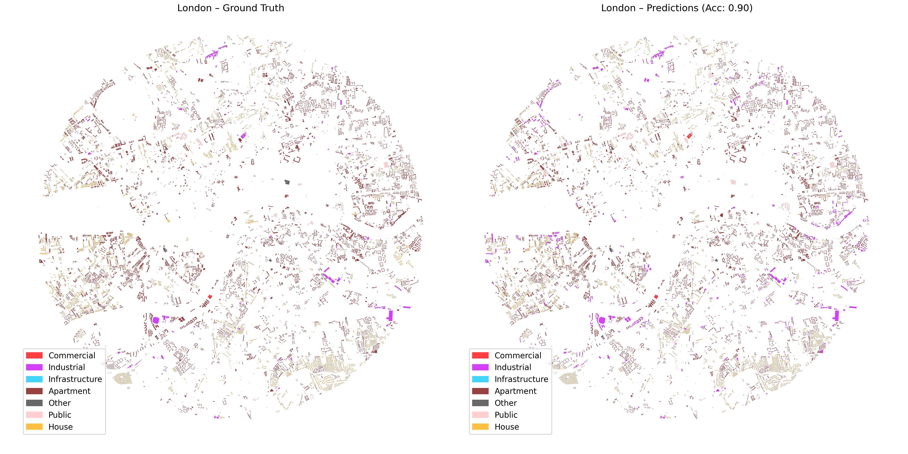

# Land Use Classification of Urban Areas

This project provides a pipeline for loading, preprocessing, visualizing, and classifying land use data using a Random Forest model. It includes functions for handling spatial data, creating visualizations, and training machine learning models.

## Functions

### load_data(file_path)

Loads spatial data from a given file path into a GeoDataFrame.

- **Parameters**:
  - `file_path` (str): Path to the spatial data file (e.g., shapefile).
- **Returns**:
  - `GeoDataFrame`: Loaded spatial data.

### visualize_data(data, output_path)

Creates a visualization of the GeoDataFrame and saves it to a specified file.

- **Parameters**:
  - `data` (GeoDataFrame): Spatial data to visualize.
  - `output_path` (str): Path to save the visualization image.

### preprocess_data(data)

Preprocesses spatial data for machine learning by extracting features and target variables.

- **Parameters**:
  - `data` (GeoDataFrame): Spatial data to preprocess.
- **Returns**:
  - `features` (DataFrame): Extracted features for the model.
  - `target` (Series): Target variable for classification.

### train_model(features, target)

Trains a Random Forest model to classify land use based on the provided features and target.

- **Parameters**:
  - `features` (DataFrame): Input features for training.
  - `target` (Series): Target variable for training.
- **Returns**:
  - `model` (RandomForestClassifier): Trained Random Forest model.
  - `X_test` (DataFrame): Test set features.
  - `y_test` (Series): Test set target values.
  - `predictions` (Series): Model predictions on the test set.

### visualize_predictions(test_geo_data, predictions, output_path)

Visualizes the model predictions alongside the ground truth on the GeoDataFrame and saves it to a file.

- **Parameters**:
  - `test_geo_data` (GeoDataFrame): GeoDataFrame containing test data.
  - `predictions` (Series): Model predictions.
  - `output_path` (str): Path to save the visualization image.

## Main Script

The `pipeline.py` script runs the entire pipeline, including data loading, preprocessing, visualization, model training, and prediction visualization.

## Results

The results of the model predictions are saved as a GeoDataFrame, and the visualizations are saved as images in the specified output directory.

## License

This project is licensed under the MIT License.
