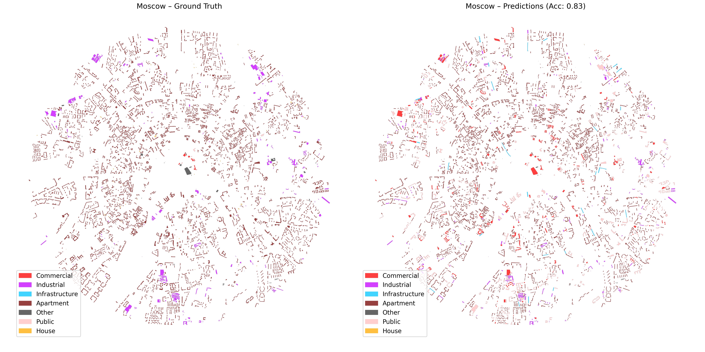

# Building Type Classification for Urban Areas

This project implements a machine learning pipeline for classifying building types in urban areas using Random Forest models. The system processes building geometry data from OpenStreetMap and predicts building categories such as residential, commercial, industrial, and public buildings across multiple European cities.

## Project Structure

- `data_preprocessing.py` - Data loading, cleaning, and feature extraction
- `data_prediction.py` - Model training and evaluation using Random Forest
- `data_visualization.py` - Visualization of predictions and performance metrics
- `model_selection.py` - Model comparison and hyperparameter tuning
- `osmnx_reader.py` - Utility for downloading building data from OpenStreetMap
- `file_renamer.py` - Utility for standardizing data file names

## Dataset

The project uses building footprint data from 7 major European cities:

- Amsterdam
- Barcelona
- Berlin
- London
- Milano
- Moscow
- Paris

Each city's data includes building geometries and OpenStreetMap tags for building types.

## Features

The model uses the following geometric and spatial features:

- **Compactness** - Shape regularity measure
- **Global Integration** - Connectivity to the broader urban network
- **Local Integration** - Local neighborhood connectivity
- **Building Coverage** - Ratio of building area to total area
- **Building X-Dimension** - Width of minimum rotated bounding box
- **Building Y-Dimension** - Height of minimum rotated bounding box

## Building Categories

Buildings are classified into 7 main categories:

- **Single-family** - Houses, detached homes, terraces
- **Multi-family** - Apartments, residential buildings
- **Commercial** - Retail, offices, supermarkets
- **Industrial** - Warehouses, factories
- **Public** - Schools, hospitals, government buildings
- **Infrastructure** - Transportation, utilities
- **Other** - Miscellaneous building types

## Key Functions

### Data Preprocessing (`data_preprocessing.py`)

- `load_and_preprocess(data_path, balance_method)` - Loads shapefiles and applies preprocessing
- `group_building_types(building_type)` - Maps OSM tags to building categories
- `compute_features(gdf)` - Extracts geometric features from building polygons

### Model Training (`data_prediction.py`)

- Trains Random Forest classifier with hyperparameter optimization
- Uses GroupKFold cross-validation to prevent data leakage between cities
- Implements class balancing using SMOTE oversampling

### Visualization (`data_visualization.py`)

- Generates confusion matrices and feature importance plots
- Creates spatial visualizations comparing predictions vs ground truth
- Produces per-city and overall performance metrics

## Usage

1. **Data Preparation**: Place building shapefiles in the `data/` directory with city-specific folders
2. **Run Preprocessing**: Execute `data_preprocessing.py` to clean and extract features
3. **Train Model**: Run `data_prediction.py` to train the Random Forest classifier
4. **Generate Visualizations**: Execute `data_visualization.py` to create performance plots
5. **Download New Data**: Use `osmnx_reader.py` to fetch data for additional cities

## Model Performance

The Random Forest model achieves:

- **Overall Accuracy**: 85.78%
- **Macro F1-Score**: 47.87%

Performance varies by building type:

- Multi-family residential: 91% F1-score (best performance)
- Single-family residential: 81% F1-score
- Industrial buildings: 40% F1-score
- Commercial buildings: 18% F1-score (challenging due to class imbalance)

## Requirements

```bash
pip install geopandas pandas numpy scikit-learn matplotlib osmnx shapely imbalanced-learn
```

## Data Sources

Building data is sourced from OpenStreetMap using the OSMnx library. The project focuses on European cities with high-quality building type annotations.

## Conference Presentation

This work was presented at the [32nd Conference of the International Seminar on Urban Form (ISUF 2025)](https://www.isuf2025.org/) in Torino, Italy.

## Citation

If you use this work in your research, please cite:

```bibtex
Karadogan, S., Yetkin, O., Efeoglu, E., and Coban, A. B. 2025. "AI-Integrated Pattern Prediction Model: Exploring the Influence of Building Fabric Morphology on Land Use Pattern 2025." In *Urban Morphology in the Age of Artificial Intelligence, Proceedings of the XXXII Conference International Seminar on Urban Form (ISUF 2025)*. Torino, Italy.
```

## Results





## License

This project is licensed under the MIT License.
